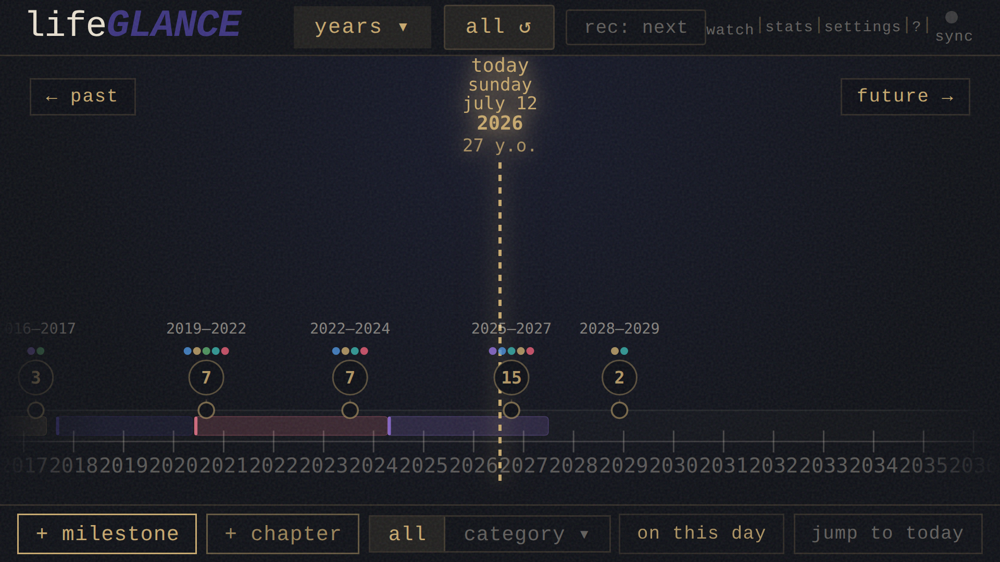
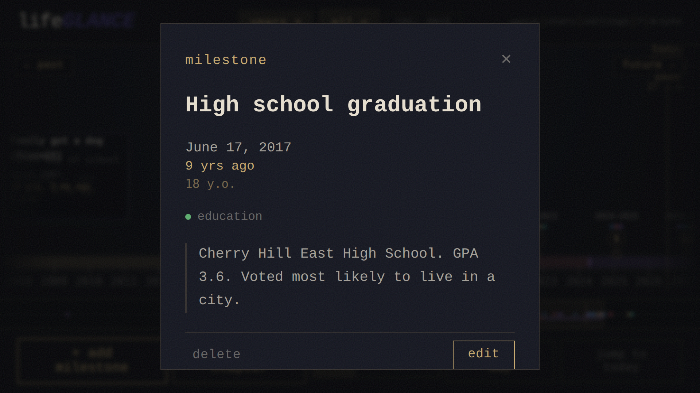

# lifeGLANCE

**Your life, at a glance.** A zoomable personal timeline for milestones, past and future. Runs entirely in your browser, with no account, no server, and no sync. Your data never leaves your device.

Part of the **GLANCE family**: focused, standalone apps connected through a shared intent protocol. See also [dayGLANCE](https://github.com/krelltunez/dayGLANCE) (today), [lastGLANCE](https://github.com/krelltunez/lastGLANCE) (recent upkeep), and lifeGLANCE (your whole timeline).

[](https://play.google.com/store/apps/details?id=com.lifeglance.app)

[](LICENSE)
[](../../releases)

---


---

## Quick Start

Use the hosted version at [lifeglance.app](https://lifeglance.app), or self-host with Docker.

### Self-host with Docker

```bash
docker run -d \
  -p 8080:80 \
  --restart unless-stopped \
  ghcr.io/krelltunez/lifeglance:latest
```

Or with Docker Compose:

```yaml
services:
  app:
    image: ghcr.io/krelltunez/lifeglance:latest
    ports:
      - "8080:80"
    restart: unless-stopped
```

Available at `http://localhost:8080`.

### Build from Source

Requires Node 20+.

```bash
npm install
npm run dev
```

The dev server starts at `http://localhost:5173`.

```bash
npm run build   # outputs to /dist
npm run preview # serve the production build locally
```

The Docker image builds with Node 20 Alpine and serves the static output via nginx.

---

## Android App

A native Android app is available on Google Play and as a direct APK download. The Google Play build is a commercial binary whose purchase supports continued development; the APK on the releases page is free.

[](https://play.google.com/store/apps/details?id=com.lifeglance.app)

[**Download APK from Releases →**](../../releases)

[**Get it on Obtainium →**](https://github.com/ImranR98/Obtainium)
<br> *Just point Obtainium to `krelltunez/lifeGLANCE`!*

The Android app ships the full web app in a WebView with native enhancements that aren't possible in a browser:

| Feature | Details |
|---|---|
| 🏠 **Home screen widgets** | Next milestone countdown, Today (date + age), Current chapter, On this day, milestone stats, and colour-slot pinned countdowns |
| ➕ **Quick add everywhere** | A Quick Add widget, a Quick Settings tile, and long-press app shortcuts all open the add-milestone sheet in one tap |
| 📤 **Share to add** | Share a link or text from any app to drop it straight into a new milestone |
| 🔗 **GLANCE intents** | A cross-app intent protocol links lifeGLANCE with the rest of the GLANCE family |
| 🔄 **Encrypted sync** | Opt-in WebDAV / GLANCEvault sync, end-to-end encrypted with a passphrase you control |
| 📴 **Full offline** | The whole timeline works offline; photo, audio, and video attachments are stored as local blobs on-device |

| Timeline | Milestone detail |
|:-:|:-:|
|  |  |

---

## Features

**Timeline**
- Smooth pan and zoom from individual weeks to multiple decades
- Past and future milestones on a single continuous axis
- Keyboard navigation between milestones and zoom levels
- Cluster badges for dense date ranges
- "Today" marker with date, day of week, and optional age display

**Milestones**
- Title, date (day / month / year precision), category, note, and URL
- Photo, audio, and video attachments stored as local blobs, with no base64 bloat
- Annual recurrence with configurable end year
- Inline delete confirmation, undo / redo history

**Views & search**
- All / Past / Future view modes
- Full-text search across titles and notes
- Stats panel and summary modal
- "On this day": milestones from this date in past years
- Minimap scrubbar for fast navigation

**Import / export**
- Import events from `.ics` calendar files
- Export timeline as a high-resolution PNG (2x, with branding watermark)
- JSON backup and restore

**App**
- Installable PWA, works fully offline after first load
- Ambient generative audio with mute toggle
- Adjustable text size
- Portrait-mode warning for mobile

---

## Keyboard Shortcuts

| Key | Action |
|---|---|
| `←` / `→` | Cycle past / future milestones |
| `↑` / `↓` | Zoom out / in |
| `1` – `9` | Custom zoom to N years |
| `C` | Custom zoom input |
| `T` | Jump to today |
| `P` / `A` / `F` | Past / All / Future view |
| `N` | New milestone |
| `E` | Export image |
| `/` | Search |
| `S` | Settings |
| `M` | Mute / unmute |
| `⌘Z` / `Ctrl+Z` | Undo |
| `⌘⇧Z` / `Ctrl+Y` | Redo |
| `?` | Help |
| `Esc` | Close modal |

---

## Tech Stack

| Layer | Technology |
|---|---|
| Framework | React 18 + Vite |
| PWA | vite-plugin-pwa (Workbox) |
| Storage | IndexedDB (milestones, media, sync keys), localStorage (settings, sync config) |
| Dates | date-fns |
| Font | Courier Prime (Google Fonts, cached offline) |
| Audio | Web Audio API, synthesised, no samples |
| Deployment | Docker + nginx |

---

## Sync & Storage

By default all data stays on your device, stored locally using IndexedDB — nothing is sent anywhere. Cross-device sync is opt-in: when you enable it, your timeline is synced to a WebDAV server or GLANCEvault instance that **you** choose and control, and can be end-to-end encrypted with a passphrase so the server only ever sees ciphertext.

| Store | Contents |
|---|---|
| IndexedDB `milestones` | Milestone records (text fields, flags) |
| IndexedDB `media` | Audio / video blobs, keyed by milestone ID |
| IndexedDB `lifeglance-crypto` | Sync encryption keys — present only when encrypted sync is enabled |
| `localStorage` | Settings and preferences, and — when sync is enabled — your WebDAV / GLANCEvault server URL and credentials |

Media blobs are fetched lazily, only when you open a milestone detail or click play, so startup time stays fast regardless of how many attachments you have.

**Deletions** propagate through sync for 90 days. If a device stays offline longer than that and then reconnects, items it deleted before going offline can reappear — sync no longer has a record of the deletion. Reconnect syncing devices at least once within 90 days to avoid this.

**Backup:** use *Settings → save backup* to export a JSON file of your milestone records. **Audio and video attachments are not included in the JSON backup, so re-attach them after restoring if needed.**

**Storage limits** vary by browser. Chrome and Firefox allow multiple GB. Safari on iOS is more restrictive and may evict data for origins not visited for 7+ days unless the app is installed to the home screen. The current usage and available quota are shown in the Help modal (`?`).

---

## Privacy

lifeGLANCE has no backend of its own, no analytics, and no tracking. Beyond loading the app and the Courier Prime font (cached after first load), network activity happens only when *you* opt in: syncing to the server you configure, and — in the app-store build — subscription checks through your app store's billing. Your timeline data is yours alone.

---

## Contributing

Small fixes are welcome, and larger changes should start with an issue. See [CONTRIBUTING.md](CONTRIBUTING.md) for scope, expectations, and conventions.

---

## License

The source is [MIT](LICENSE)-licensed: free to build, self-host, modify, and
distribute. The web app is free to use — [hosted](https://lifeglance.app) or
self-hosted — and a free Android APK is on the [releases](../../releases) page.
The paid Google Play and App Store builds are a convenience distribution that
funds development — you're paying for the packaged, signed, auto-updating
binary, not the code.

The **lifeGLANCE** name, logo, and app icon are trademarks and are not covered
by the MIT license.

---

## Support

If lifeGLANCE has been useful to you, consider supporting its development:

[](https://github.com/sponsors/krelltunez)
[](https://ko-fi.com/krelltunez)
